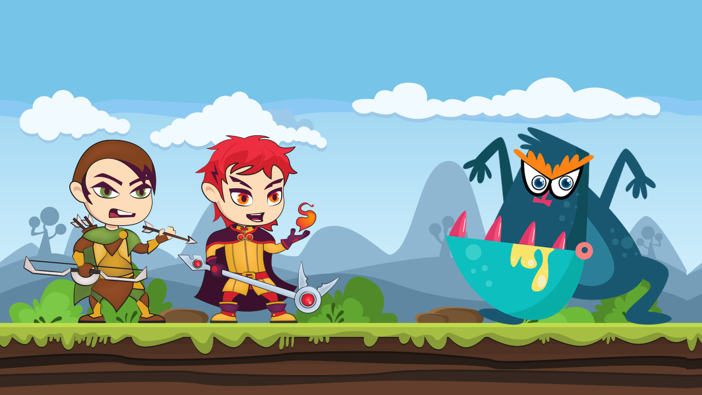
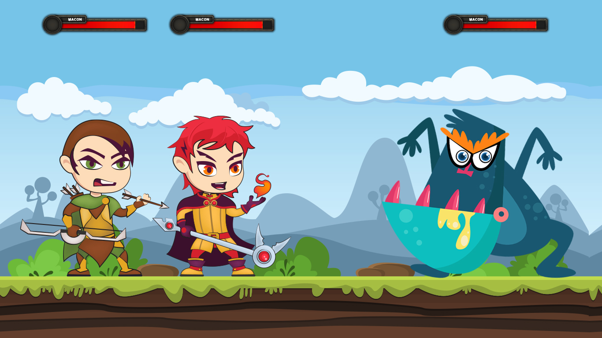
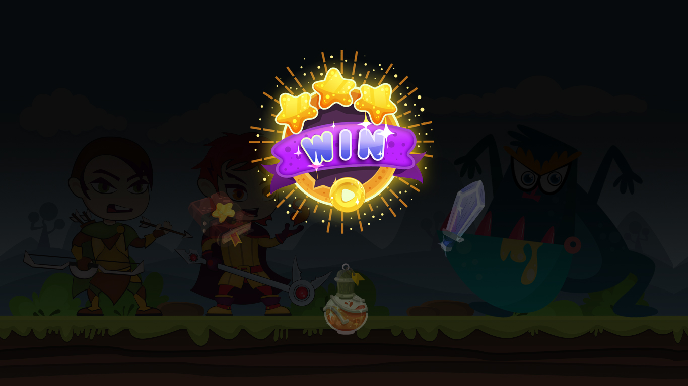
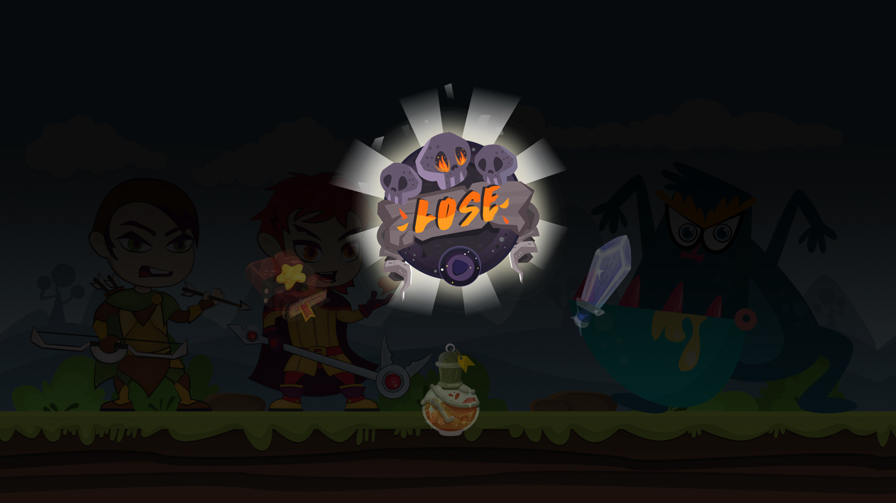
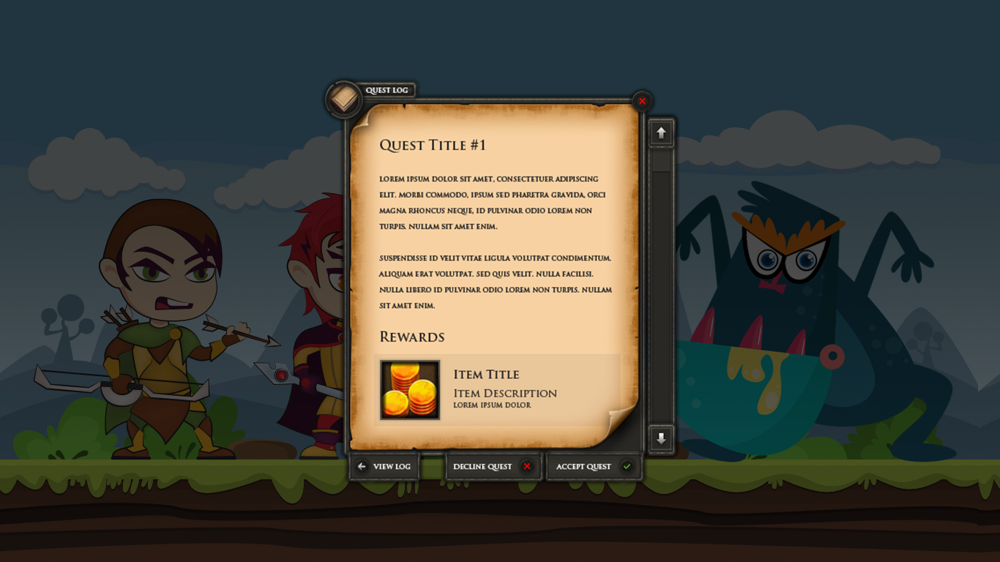
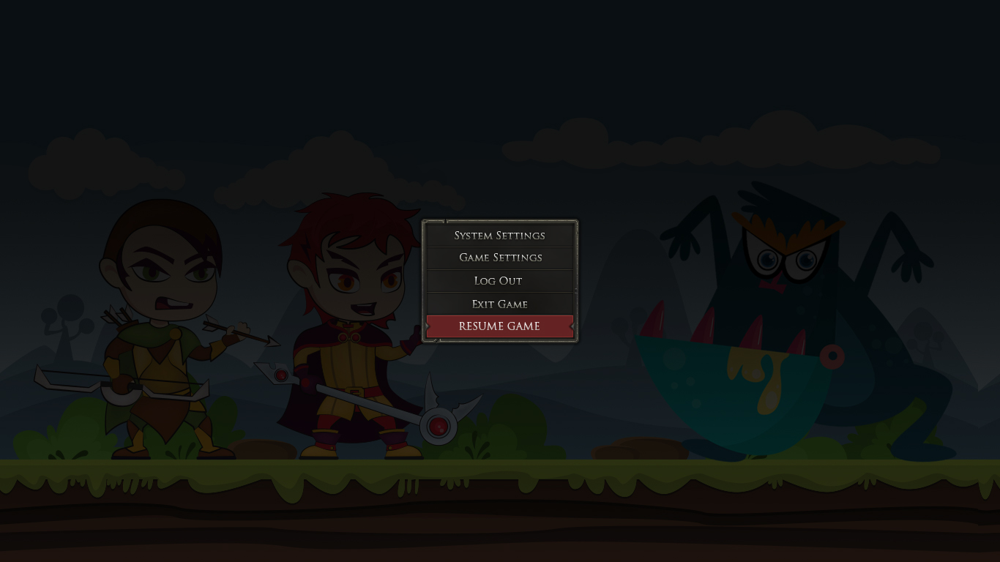
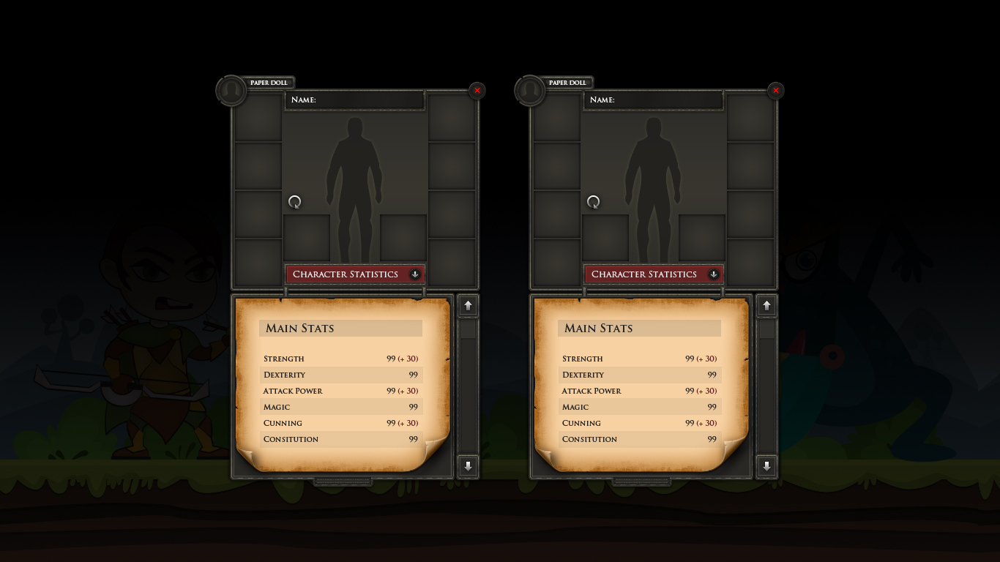

# Macon Trouble
Turn Based RPG

### Macon must prevent the evil from taking over the village.

## MVP
* Will have 1 player
* Will encounter 3 small enemies
* Will encounter final boss
* Keeping track of HP
* Be able to attack
* Be able to defend

## GamePlay

* User clicks start button to begin game
* A dialogue box pops up prompting the player to click a button to select a class
* Select your Class - Options (50pt distribution between classes)
  * Warrior - Stats (Attack: 15, Defense: 10,  Accuracy: 10, HP: 15)
  * Healer - Stats(Attack: 10, Defense: 17, Accuracy: 10, HP: 13)
   * Stretch Goal => Rogue - Stats(Attack: 10, Defense: 15, Accuracy: 15, HP:10)
   * Stretch Goal => Wizard - Stats(Attack: 18, Defense: 10, Accuracy: 14, HP: 8)
  ---
* After the player selects a class, a sprite is randomly generated based on player class selection
  * Stretch Goal => Player Sprite Choice
  * Stretcj Goal =>  One companion is assigned to the party - this will be a healer unless the player chooses the healer class. If the player chooses a healer, the user is assigned a random party member (non-healer).
  * Stretch Goal => 3 Companions
  * Stretch Goal => Companion Class Choice
  * Stretch Goal => Companion Sprite Choice
* Companion sprite randomly generated
  * Stretch Goal => Generate random class-based sprite for non-healer
---
* A pop-up dialogue box with party member stats and sprites displayed after companion generated. 
* Stats are displayed beside the character sprites
* Dialogue for Pop-up:
  * This is your party. Are you ready for adventure? Yes or No?
* If the player clicks yes, start the game. If the player clicks no, exit game.
---
* After the yes button is clicked, display the game rules and interaction in the dialogue box.
* Right arrow to move forward, back arrow to move backward.  
* The player can select a button from a dialogue box with an attack option when encountering an enemy.
* Once in battle, you must play till the end of the encounter.
* The player wins if they beat the boss, there will be 3 enemy encounters before the boss.
  * Stretch Goal = > Multiple enemies per encounter
---
* If the player moves across the screen to the right for 5 seconds, an enemy encounter will be triggered.
* A dialogue box will pop up when you encounter an enemy with options:
* Do you want to attack or run away? If the player clicks the attack button, the battle begins. If the player clicks the runaway button, the game ends.
* If the player clicks attack, a dialogue box will open with attack options:
  * Option 1: Click the button to Attack = Base attack
  * Option 2: Click the button to Defend = +5 to Defense (adds to defense on next attack from the enemy)
    * Stretch Goal => Special Class-Specific Abilities
      * Fighter => Extra Strong Attack (double damage)
      * Healer => Heals all party members +5HP
      * Rogues => Double Attack (attack twice)
      * Wizard => Eldritch Blast (double damage)
        * If multiple enemies AOE (area of effect)
---
* If the player selects the attack button, damage dealt to enemy is displayed in the dialogue box, then the player character’s turn ends.
* Then the enemy attacks a random party member.
* A dialogue box pops up with a message displaying the damage dealt and to whom.
 * Stretch Goal =>  The player now has the option to attack or heal with the companion character if the companion character is a healer. The character can only attack if non-healer. The information is displayed in the dialogue box.
---
* The gameplay loop repeats until 3 encounters have been cleared. 
* After 3 encounters have been cleared, the boss appears.
* Boss fight functions the same as the other encounters with higher stats.
  * Stretch Goal => Give boss special ability.
* Once the boss is defeated, a dialogue box pops up saying “You have saved the village” with button options to play again or exit. If the player clicks play again, the game resets and starts again. If the player chooses to exit, the credits roll, and the game exits. 
  * Stretch Goal => Keep record number of villages saved.
  * Stretch Goal => Increased encounters before a boss

### Design Concepts: 

Monster Encounter

Monster Encounter with Health Bars

Win Dialogue

Lose Dialogue

Pop-up Dialogue

Menu

Character Stats

